<h2>Part 1. Инструмент ipcalc</h2>

<h3>1.1. Сети и маски</h3>

1. Адрес сети 192.167.38.54/13 найден командой `ipcalc 192.167.38.54/13 | grep Network`

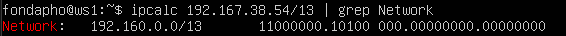

2. Перевод маски 255.255.255.0 в префиксную и двоичную запись, /15 в обычную и двоичную, 11111111.11111111.11111111.11110000 в обычную и префиксную

    - Перевод маски 255.255.255.0 выполнен командой `ipcalc 255.255.255.0 | grep -e Netmask`

    - Префиксная запись: `/24`
    - Двоичная запись: `11111111.11111111.11111111.00000000`

    

    - Перевод маски /15 выполнен командой `ipcalc 0.0.0.0 /15 | grep -e Netmask`

    - Префиксная запись: `/15`
    - Двоичная запись: `11111111.11111110.00000000.00000000`

    

    - Перевод маски 11111111.11111111.11111111.1111.0000 выполнен командой `ipcalc 11111111.11111111.11111111.1111.0000 /28 | grep -e Netmask`

    - Префиксная запись: `/28`
    - Обычная запись: `255.255.240.0`

    

3. Минимальный и максимальный хост в сети 12.167.38.4 при масках: /8, 11111111.11111111.00000000.00000000, 255.255.254.0 и /4

    - Минимальный и максимальный хост в сети 12.167.38.4 для 4 масок найдены с помощью команд `ipcalc 12.167.38.4/8 | grep -e HostMin -e HostMax`, `ipcalc 12.167.38.4/16 | grep -e HostMin -e HostMax`, `ipcalc 12.167.38.4 255.255.254.0 | grep -e HostMin -e HostMax` и `ipcalc 12.167.38.4/4 | grep -e HostMin -e HostMax` соответственно. Искомые параметры отображены на рисунке

    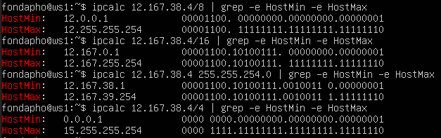

<h3>1.2. localhost</h3>

- Так как localhost присвоено IP-адресу 127.0.0.1, можно сделать вывод, что обратится к приложению по адресу:

    - 194.34.23.100 - нельзя
    - 127.0.0.2 - можно
    - 127.1.0.1 - можно
    - 128.0.0.1 - нельзя

<h3>1.3. Диапазоны и сегменты сетей</h3>

- Часные IP-адреса (попадают в частные диапазоны)

    - 10.0.0.45
    - 192.168.4.2
    - 172.20.250.4
    - 172.16.255.255
    - 10.10.10.10

- Публичные IP-адреса (не попадают в частные диапазоны)

    - 134.43.0.2
    - 172.0.2.1
    - 192.172.0.1
    - 172.68.0.2
    - 192.169.168.1

- У сети 10.10.0.0/18 возможны адреса:

    - 10.0.0.1 - невозможен
    - 10.10.0.2 - возможен
    - 10.10.10.10 - возможен
    - 10.10.100.1 - невозможен
    - 10.10.1.255 - возможен

---

<h2>Part 2. Статическая маршрутизация между двумя машинами</h2>

- Существующие сетевые интерфейсы, отображенные с помощью команды `ip a` для виртуальных машин `ws1` и `ws1` показаны на рисунке

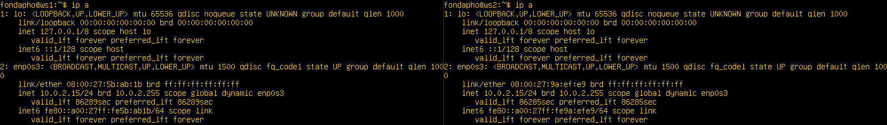

- Содержимое измененных конфигурационных файлов etc/netplan/00-installer-config.yaml для двух устройств показано на рисунке

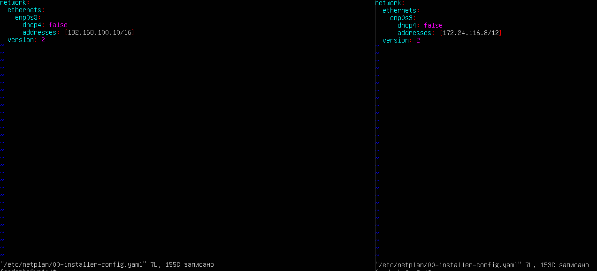

- Вызов и вывод при использовании команды `netplan apply`

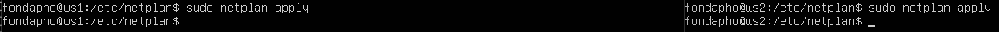

<h3>2.1. Добавление статического маршрута вручную</h3>

- Статические адреса добавлены вручную с помощью команды `sudo ip addr add`, после чего были пропингованы

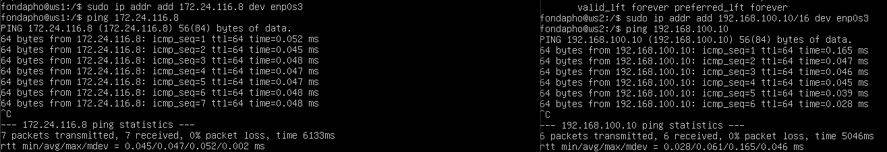

<h3>2.2. Добавление статического маршрута с сохранением</h3>

- Добавление статических маршрутов выполнено через конфигурационный файл. Содержание измененного файла показано на рисунке

- После применения команды `sudo netplan apply` соединение между устройствами было пропинговано

---

<h2>Part 3. Утилита iperf3</h2>

<h3>3.1. Скорость соединения</h3>

- 8 Mbps = 1 MB/s
- 100 MB/s = 800000 Kbps
- 1 Gbps = 1000 Mbps

<h3>Утилита iperf3</h3>

- Выполнен запуск утилиты `iperf3` на ws1 командой `iperf3 -s`

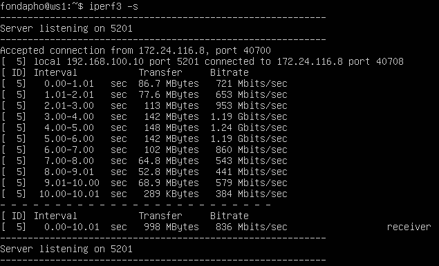

- Затем на устройстве ws2 выполнена команда `iperf3 -c 192.168.100.10`

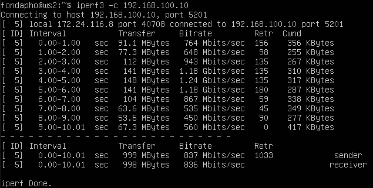
---

<h2>Part 4. Сетевой экран</h2>

<h3>4.1. Утилита iptables</h3>

- Содержание файла для ws1

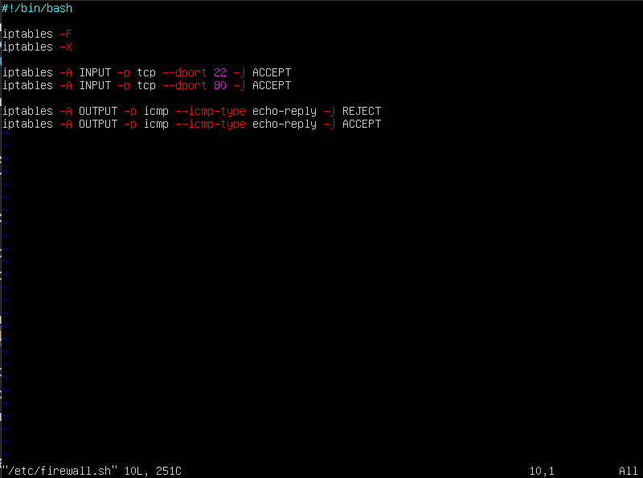

- Содержание файла для ws2

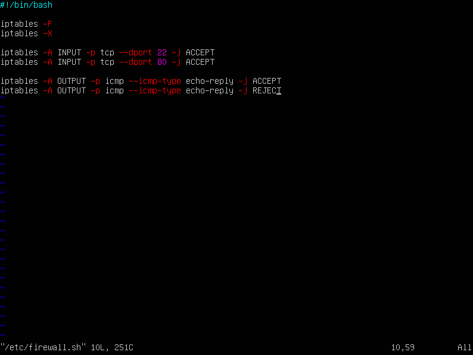

- Добавление свойства исполнимости с помощью утилиты `chmod` и запуск файла для ws1

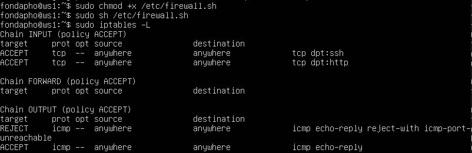

- Добавление свойства исполнимости с помощью утилиты `chmod` и запуск файла для ws2

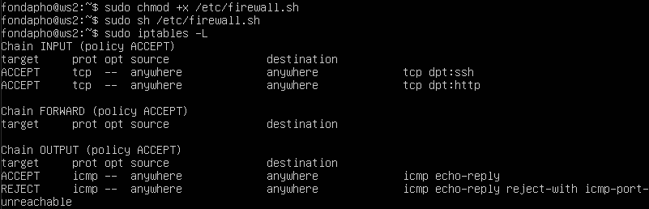

- Разница в стратегии между файлами заключается в последовательности команд. Утилита `iptables` выполняет первое прочитанное правило, на WS1 будет выполнятся `REJECT` и `ping` не пройдет, а на WS2 наоборот, первым стоит `ACCEPT`, разрешить прохождение пакета, `ping` пройдет.

<h3>4.2. Утилита nmap</h3>

- Ввиду правила из предыдущего задания, ws1 не пингуется. Утилита `nmap` показывает, что хост устройства запущен

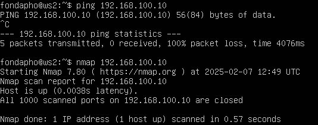
---

<h2>Part 5. Статическая маршрутизация сети</h2>

<h3>5.1. Настройка адресов машин</h3>

- Настройка конфигурации ws11

- Вывод команды `ip -4 a` для ws11

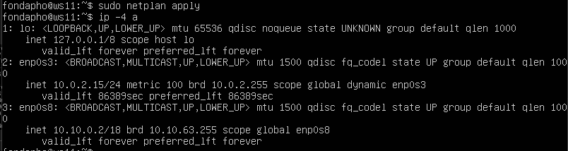

- Настройка конфигурации ws21

- Вывод команды `ip -4 a` для ws21

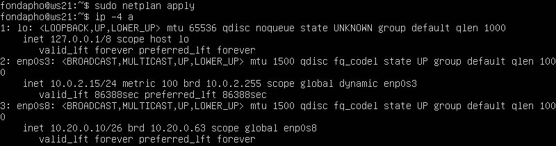

- Настройка конфигурации ws22

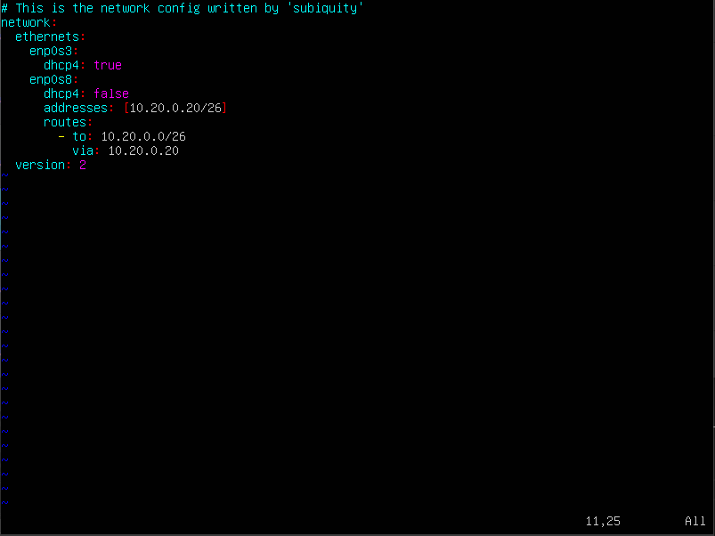

- Вывод команды `ip -4 a` для ws22

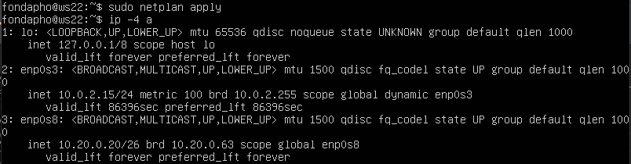

- Настройка конфигурации r1

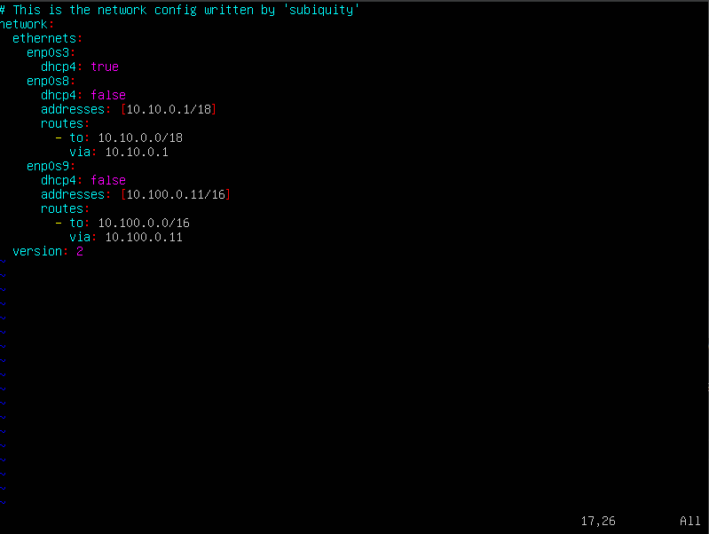

- Вывод команды `ip -4 a` для r1

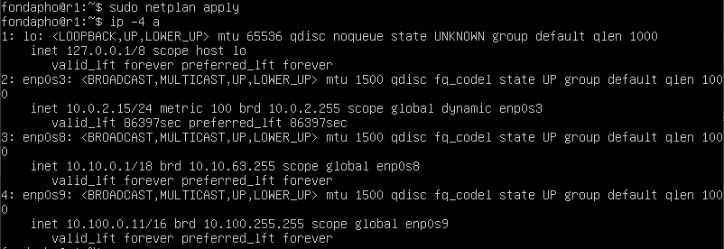

- Настройка конфигурации wsr2

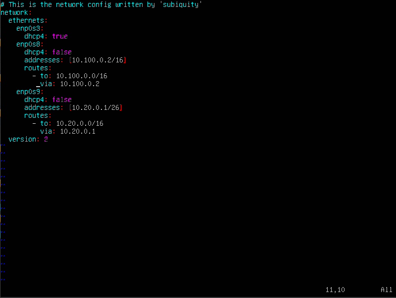

- Вывод команды `ip -4 a` для r2

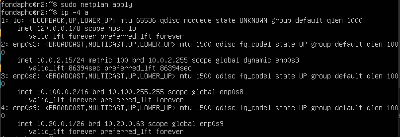

- Пинг ws22 с ws21 выполнен командой `ping -c 4 10.20.0.20`

- Пинг r1 с ws11 выполнен командой `ping -c 4 10.10.0.1`

<t3>5.2. Включение переадресации IP-адресов</t3>

- Применение команды `sysctl -w net.ipv4.ip_forward=1` на роутере r1

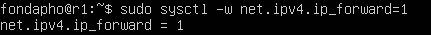

- Применение команды `sysctl -w net.ipv4.ip_forward=1` на роутере r2

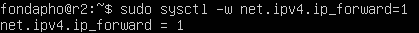

- Добавление строки `net.ipv4.ip_forward = 1` на r1

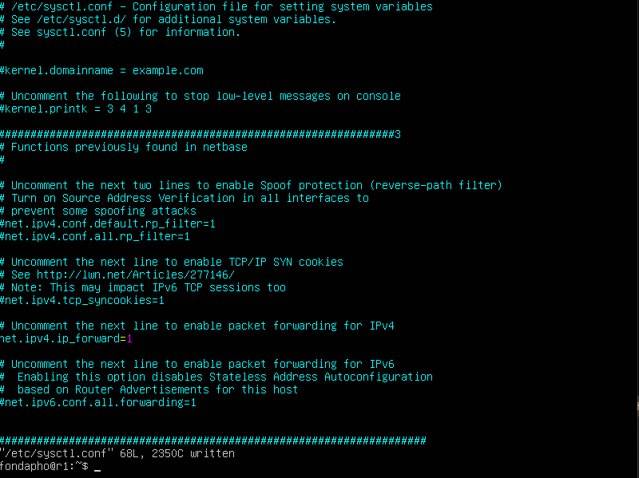

- Добавление строки `net.ipv4.ip_forward = 1` на r2

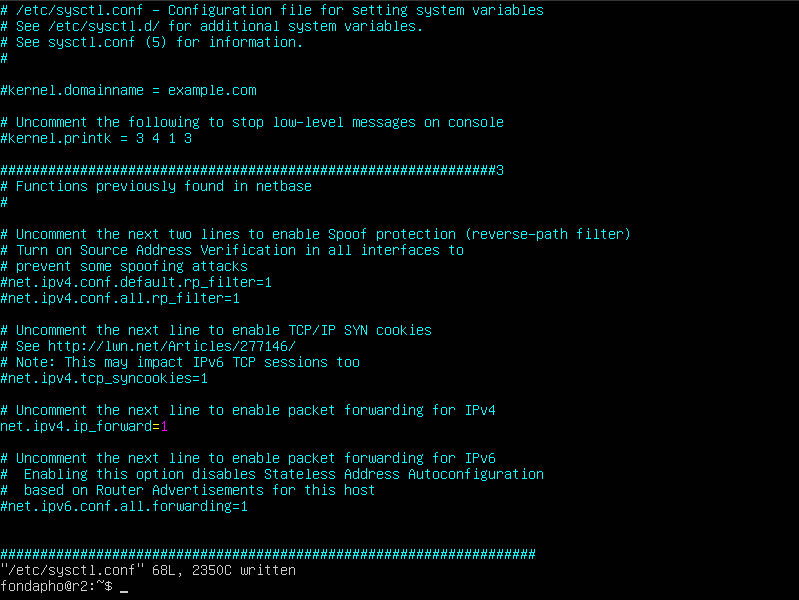

<t3>5.3. Установка маршрута по умолчанию</t3>

- Настройка шлюза для ws11

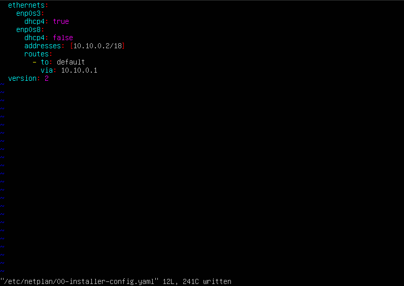

- Вывод таблицы маршрутизации для ws11

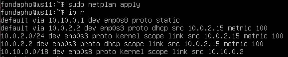

- Настройка шлюза для ws21

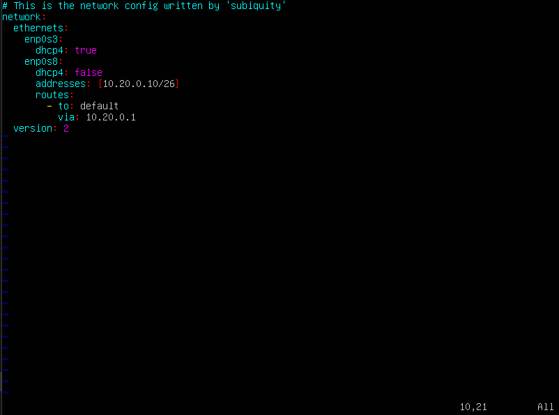

- Вывод таблицы маршрутизации для ws21

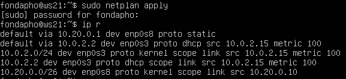

- Настройка шлюза для ws22

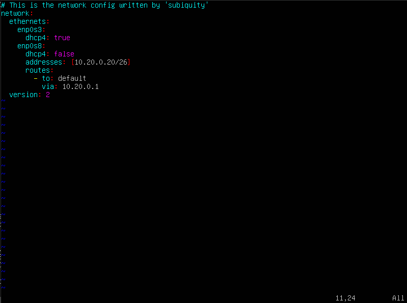

- Вывод таблицы маршрутизации для ws22

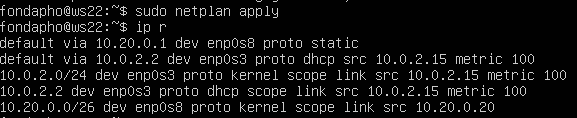

- Пинг с ws11 роутера r2

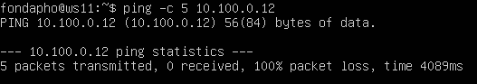

- Вывод команды `tcpdump -tn -i enp0s8`, вызванной на r2

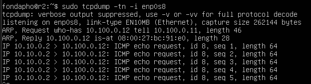

<t3>5.4. Добавление статических маршрутов</t3>

- Добавление статических маршрутов на r1

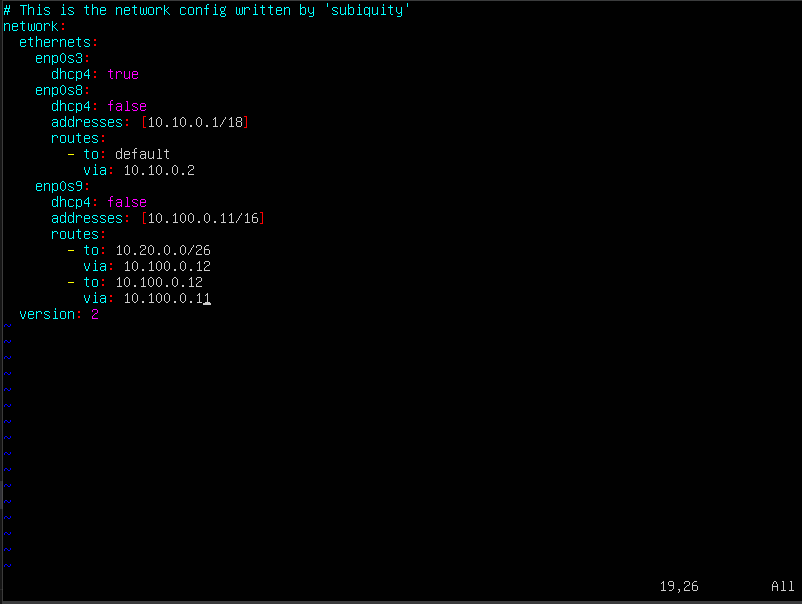

- Таблица маршрутизации для r1

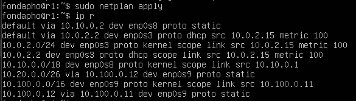

- Добавление статических маршрутов на r2

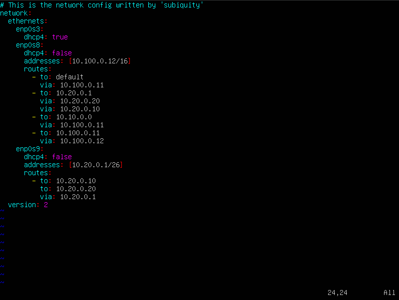

- Таблица маршрутизации для r2

- Выполнение команд `ip r list 10.10.0.0/18` и `ip r list 0.0.0.0/0`

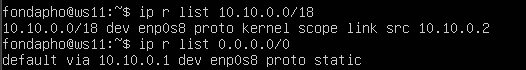

- Для адреса 10.10.0.0/18 был выбран маршрут, отличный от 0.0.0.0/0, потому что при наличии двух и более маршрутов выбирается маршрут с самой длинной маской, так как он более точный

<h3>5.5. Построение списка маршрутизаторов</h3>

- Запуск `traceroute 10.20.0.10` на ws11 для построение списка маршрутизаторов по пути до ws21

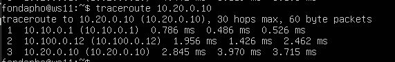

- Запуск команды `tcpdump -tnv -i enp0s8 arp` для отображения перехвата трафика по протоколу определения адреса arp

- `traceroute` определяет маршрут пакетов до конечного устройства, измеряя время прохождения через каждый промежуточный узел. Он отправляет пакеты с увеличением значения Time-to-Live (TTL) начиная с 1. Каждый маршрутизатор, уменьшая TTL, отправляет ICMP-сообщение "Time Exceeded" при достижении нуля, что позволяет определить его IP-адрес и время отклика. Увеличивая TTL на единицу, traceroute последовательно фиксирует все промежуточные узлы, пока пакет не достигнет нужного адреса или не будет заблокирован

<h3>5.6. Использование протокола ICMP при маршрутизации</h3>

- Пингование несуществующего адреса с ws11 командой `ping -c 1 10.30.0.111`

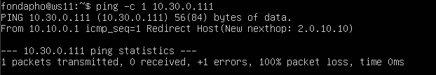

- Запуск перезвата сетевого трафика, проходящего через enp0s8, на роутере r1 `tcpdump -n -i enp0s8 icmp`

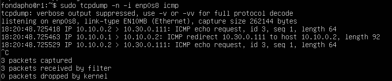
---

<h2>Part 6. Динамическая настройка IP с помощью DHCP</h2>

1. Указание адреса маршрутизатора по умолчанию, DNS-сервера и адреса внутренней сети для r2 показано на рисунке

    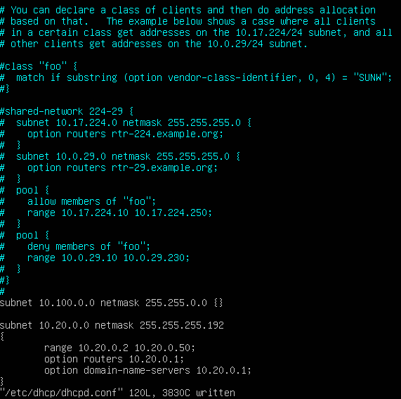

2. Указание `nameserver 8.8.8.8` в файле  /etc/resolv.conf

    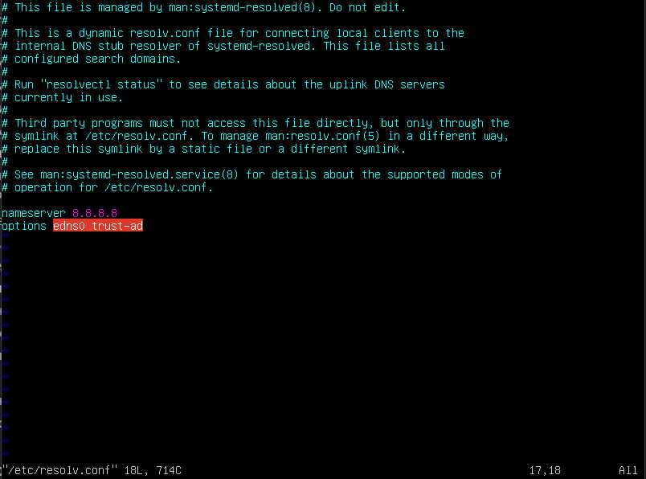

    - Перезапуск службы DHCP командой `systemctl restart isc-dhcp-server`

    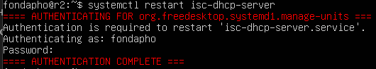

    - Измененный конфигурационный файл для ws21 с измененным параметром dhcp4 и закомментированными статическими настройками

    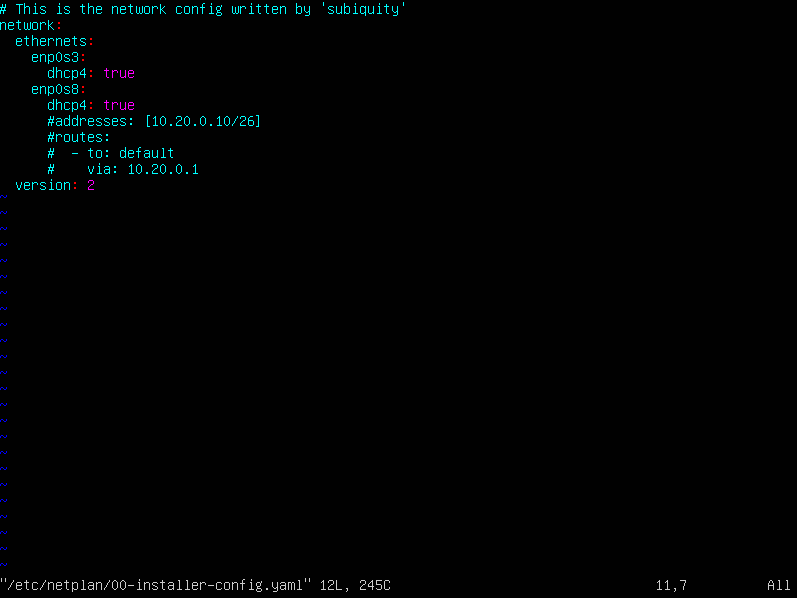

    - Вывод `ip a` на устройстве ws21. Адрес был получен

    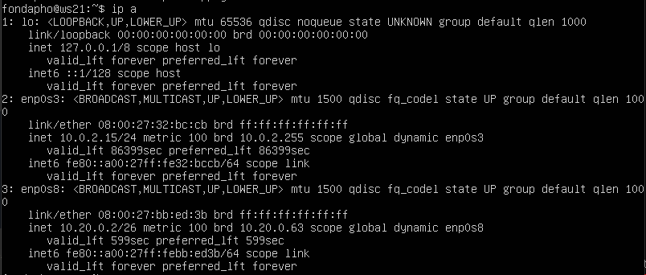

    - Пингование ws22 с ws21

    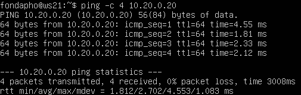

    - Указание MAC-адреса и параметра dhcp4 в конфигурационном файле etc/netplan/00-installer-config.yaml на ws11

    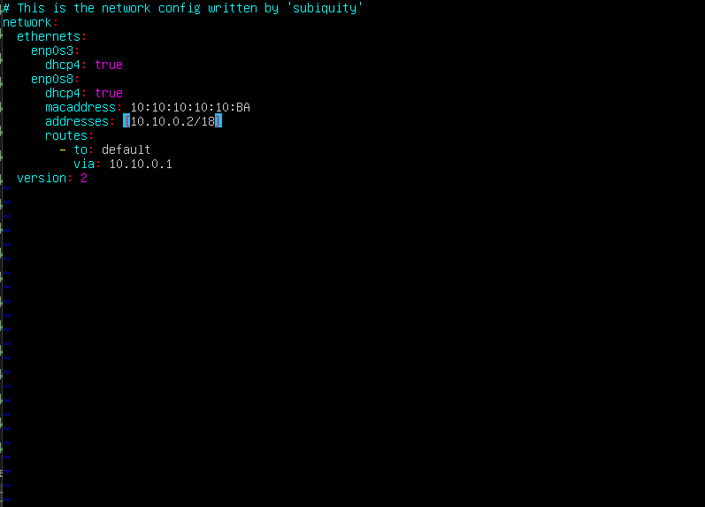

    - Изменение MAc-адреса в настройках устройства

    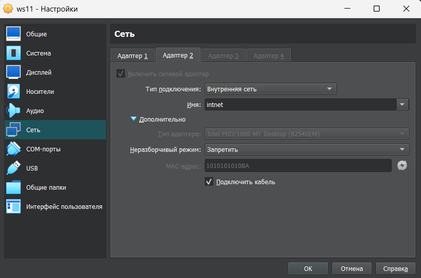

    - Настройка dhcpd.conf на r1

    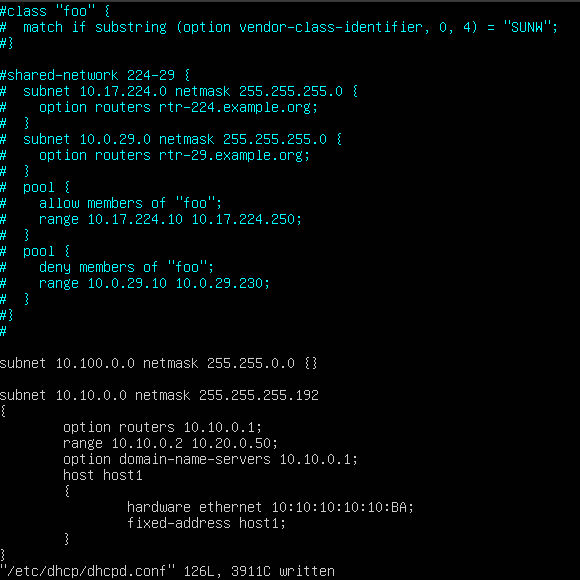

    - ws11 `ip a` после перезапуска службы DHCP

    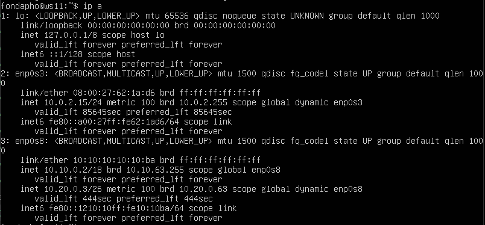

    - ws21 `ip a` до обновления IP-адреса

    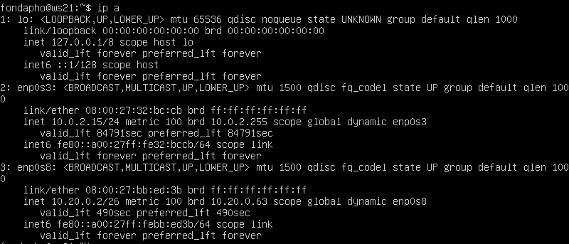

    - Обновление IP-адреса ws21 командой `sudo dhclient enp0s8` и новый вывод `ip a`

    

- При выполнении заданий части 6 были использованы опции DHCP:
    
    - option routers ip-address - адрес шлюза для сети клиента

    - option domain-name-server ip-address - список DNS серверов, доступных клиенту
---

<h2>Part 7. NAT</h2>

- На устройствах ws22 и r1 в конфигурационном файле /etc/apache2/ports.conf заменяем строку для изменения доступности сервера Apache2

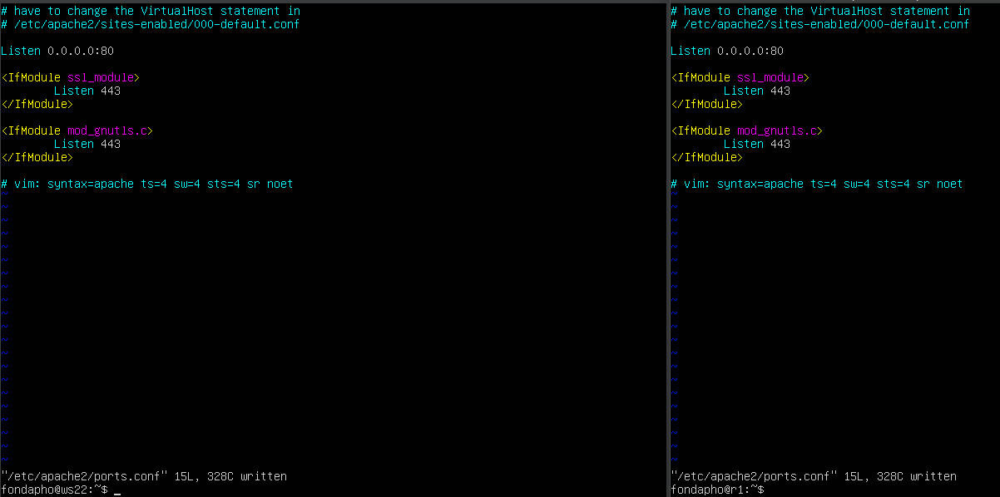

- Веб-сервер Apache запущен на тех же устройствах командой `service apache2 start`

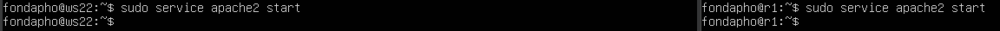

- Добавление фаервола на r2 через файл /etc/firewall.sh

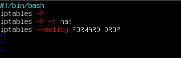

- Предание файлу свойства исполнимости и его запуск

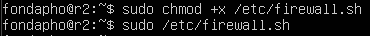

- Проверка соединения ws22 и r1 через пингование

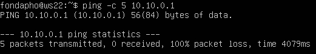

- Изменение файла с фаерволом на r2 добавлением разрешения маршрутизации всех пакетов протокола ICMP

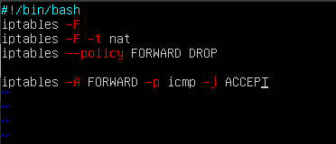

- Повторная проверка соединения ws22 и r1 через пингование

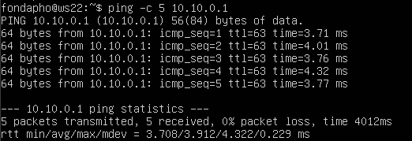

- Изменение файла с фаерволом на r2 добавлением включения SNAT, DNAT и разрешенразрешенияием на прослушку TCP

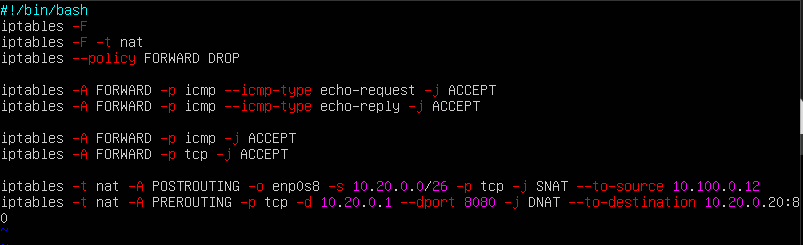

- Подключение к серверу Apache на r1 с ws22

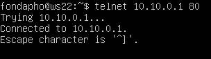

- Подключение к серверу Apache на ws22 с r1

